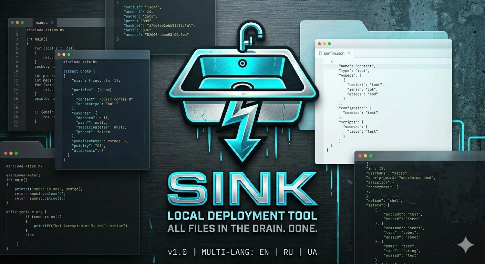

# ⚓ Sink

[English](#english) | [Русский](#русский) | [Українська](#українська)

---



---

<a name="english"></a>
## 🇬🇧 English

> **Stop syncing, start sinking.** > A lightweight, git-like CLI tool to "push" your code from a comfortable workspace into awkward, hard-to-reach local directories.

### 💡 The Problem
Many development environments (emulators, local web servers, or embedded systems) require your source files to be located in specific, often "hostile" directories. Keeping your project in those system folders is risky, inconvenient for your IDE, and makes version control a nightmare.

### ✨ The Solution
**Sink** allows you to keep your source code in a safe, version-controlled folder. When you're ready to test, just `push` it to the target environment. It's like a direct pipe for your files.

* **Git-like Workflow:** Familiar `init` and `push` commands.
* **Safety Net:** Your source stays safe; the target is just a "sink" (receiver) for your files.
* **Ignore Support:** Use `.sinkignore` to keep `.git`, `.env`, and temp files out of the destination.

### 🚀 Quick Start
1.  **Initialize:** `sink init /path/to/target/` (creates a `.sink` config).
2.  **Configure:** Add unwanted files to `.sinkignore`.
3.  **Push:** Run `sink push` to instantly mirror your files to the target. Use `sink push -c` for a clean transfer (deletes all contents in target directory before copying).

---

<a name="українська"></a>
## 🇺🇦 Українська

> **Досить синхронізувати, почни «зливати» (sink it).** > Легкий CLI-інструмент у стилі Git для «пушу» вашого коду зі зручного робочого простору в незручні або важкодоступні локальні директорії.

### 💡 Проблема
Багато середовищ розробки (емулятори, локальні вебсервери або вбудовані системи) вимагають, щоб ваші вихідні файли знаходилися у специфічних, часто «ворожих» системних папках. Тримати проєкт безпосередньо там ризиковано, незручно для IDE, а контроль версій перетворюється на хаос.

### ✨ Рішення
**Sink** дозволяє зберігати вихідний код у безпечній папці з контролем версій. Коли ви готові до тестування, просто «проштовхніть» (push) його в цільове середовище. Це як пряма труба для ваших файлів.

* **Ворклоу як у Git:** Знайомі команди `init` та `push`.
* **Мережа безпеки:** Ваш вихідний код залишається недоторканим; цільова папка — це лише «приймач» (sink) для файлів.
* **Підтримка ігнорування:** Файли `.git`, `.env` та тимчасові файли не потраплять у ціль завдяки `.sinkignore`.

### 🚀 Швидкий старт
1.  **Ініціалізація:** `sink init /шлях/до/цілі/` (створює конфіг `.sink`).
2.  **Налаштування:** Додайте виключення у `.sinkignore`.
3.  **Пуш:** Запустіть `sink push`, щоб миттєво віддзеркалити файли. Використовуйте `sink push -c` для чистого переносу (видаляє весь вміст цільової папки перед копіюванням).

---

<a name="русский"></a>
## 🏳️  Русский

> **Хватит синхронизировать, пора сливать (sink it).**
> Легковесный CLI-инструмент в стиле Git для «пуша» вашего кода из удобного рабочего пространства в неудобные или труднодоступные локальные папки.

### 💡 Проблема
Многие среды разработки (эмуляторы, локальные веб-серверы или встроенные системы) требуют, чтобы исходные файлы находились в специфических, часто «враждебных» системных папках. Держать проект непосредственно там рискованно, неудобно для вашей IDE, а контроль версий превращается в хаос.

### ✨ Решение
**Sink** позволяет хранить исходный код в безопасной папке с контролем версий. Когда вы готовы к тестированию, просто «протолкните» (push) его в целевую среду. Это как прямая труба для ваших файлов.

* **Ворклоу как в Git:** Знакомые команды `init` и `push`.
* **Сеть безопасности:** Ваш исходный код остается нетронутым; целевая папка — это лишь «приемник» (sink) для файлов.
* **Поддержка игнорирования:** Файлы `.git`, `.env` и временные файлы не попадут в цель благодаря `.sinkignore`.

### 🚀 Быстрый старт
1. **Инициализация:** `sink init /путь/до/цели/` (создает конфиг `.sink`).
2. **Настройка:** Добавьте исключения в `.sinkignore`.
3. **Пуш:** Запустите `sink push`, чтобы мгновенно отзеркалить файлы. Используйте `sink push -c` для чистого переноса (удаляет все содержимое целевой папки перед копированием).

---

## 🛠 Commands / Команды / Команди

| Command | Description | Описание | Опис |
| :--- | :--- | :--- | :--- |
| `sink init <path>` | Link current folder to a target | Привязать текущую папку к цели | Прив'язати папку до цілі |
| `sink push [-c]` | Copy files to target (`-c` cleans target first) | Копировать файлы в цель (`-c` сначала очищает цель) | Копіювати файли до цілі (`-c` спочатку очищує ціль) |
| `sink status` | Show current configuration | Показать текущую конфигурацию | Показати поточні налаштування |

## 📄 License
This project is licensed under the **(GNU GPL 3.0)**.

---

## 🛠 Build & Installation

Since **Sink** is written in pure C, it has no dependencies and is extremely easy to build on macOS, Linux, or Windows.

### 1. Requirements
* A C compiler (like `gcc` or `clang`)
* `make` (optional, but recommended)

### 2. Compilation
Open your terminal in the project folder and run:

```bash
gcc main.c -o sink
```

---
*Created with Love for developers who hate digging through AppData folders.*